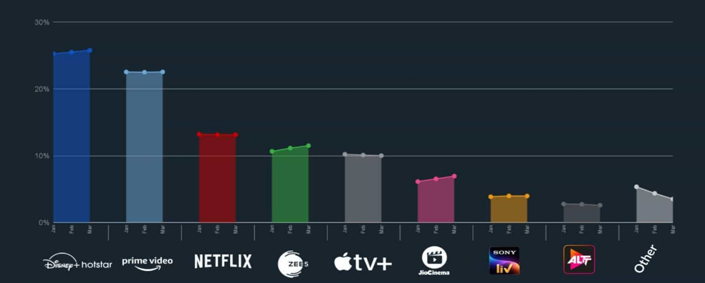

# Disney+ Hotstar Data Analysis

---
 
## Introduction

**Disney+ Hotstar** is an online video streaming platform owned by Novi Digital Entertainment Private Limited, a wholly owned subsidiary of Star India Private Limited. It offers:

- Over 100,000 hours of TV content and movies across 9 languages.
- Live coverage of every major sport.
- Highly evolved streaming technology and excellent user experience across devices.

---

## Market Share Development in 2024

### Why Hotstar is the Go-To OTT Platform
- Vast content library including:
  - Popular Indian TV shows.
  - Live sports like IPL cricket.
  - Disney, Pixar, Marvel, and Star Wars titles.
- Affordable subscription plans attract a diverse audience in India and globally.

---

## Analysis Tasks

### Task 1: Distribution of Movies by Genre
- Visualizing the distribution of movies categorized by their genres.

### Task 2: Average Running Time by Genre
- Examining how the average running time varies across genres.

### Task 3: Movies Released Each Year
- Analyzing the count of movies released year by year.

### Task 4: Top 10 Longest Movies
- Listing the longest movies based on their runtime.

### Task 5: Movies by Age Rating
- Categorizing movies based on their age ratings.

---

### Task 6: Count of Movies by Year and Genre
- Comparing the count of movies released across genres each year.

### Task 7: Count of Titles by Type
- Understanding the distribution of content types (e.g., movies, shows).

### Task 8: Correlation Between Running Time and Year
- Investigating the relationship between a movie's runtime and release year.

### Task 9: Genre Popularity Over Time
- Observing trends in the popularity of genres over time.

### Task 10: Movies by Genre and Age Rating
- Exploring the intersection of genres and their age ratings.

---

### Task 11: Movies with Maximum Episodes
- Highlighting the titles with the highest number of episodes.

### Task 12: Distribution of Running Time
- Visualizing the distribution of movies based on their runtime.

### Task 13: Analysis of Specific Genres
- Conducting a deeper analysis of selected genres.

---

## Final Dashboard

- An interactive dashboard summarizing all tasks and key insights.

---

**Prepared by:** Sriram V  
**Batch:** BADM-WD-E-B7
